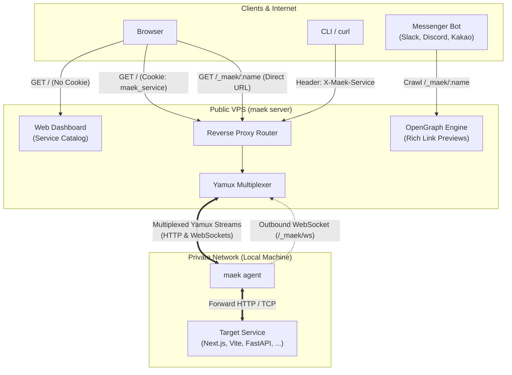

<div align="center">

# maek<span style="color:#1d9bf0">.</span>

**Instant tunnels to your localhost. Zero DNS, zero accounts, pure simplicity.**

*The self-hosted, single-binary ngrok alternative with automated link previews and Twitter-style dashboard.*

<br/>

[](https://go.dev/)
[](LICENSE)
[](https://hub.docker.com/)
[](internal/server/static)
[](#zero-config-routing-no-wildcard-dns)
[](#architecture)

<br/>

```bash
# 1. On your VPS ($3/mo, no domain needed)
maek server -p 8080

# 2. On your local machine (macOS / Linux / Windows)
curl -fsSL http://<VPS-IP>:8080/_maek/install.sh | sh
maek agent -s ws://<VPS-IP>:8080 -t http://localhost:3000
```

</div>

---

## Why maek?

Most tunneling tools either lock you into monthly subscriptions, require account registrations, or force you through complicated wildcard DNS and TLS certificate setups. 

**`maek` solves this cleanly.** You run one tiny binary on a VPS, and it gives you unlimited tunnels with zero external dependencies.

| Feature | `maek` | `ngrok` (Free) | Cloudflare Tunnel | `frp` |
| :--- | :---: | :---: | :---: | :---: |
| **Account / Sign-up** | None | Required | Required | None |
| **Custom Domain / Wildcard DNS** | Not needed (IP-based) | Random subdomains | Domain required | Wildcard DNS required |
| **Tunnel Limits & Pricing** | Unlimited (Free & OSS) | 1 tunnel / rate limits | Free | Self-hosted |
| **Private / Airgap Network** | Fully self-contained | Cloud only | Cloud only | Manual binary copy |
| **Client Installation** | One-line script from VPS | Cloud download | Package manager | Manual configuration |
| **Web Catalog Dashboard** | Twitter-style UI | Web dashboard | Cloud console only | Basic admin UI |
| **Auto Metadata Scraping** | Title, icon, description | None | None | None |
| **Social / Messenger Previews** | Slack, Discord, KakaoTalk | None | None | None |
| **WebSocket & Vite HMR** | Full Yamux multiplexing | Yes | Yes | Yes |

---

## Key Features

### 1. Single-IP, Zero-DNS Multi-Tenant Routing
Expose multiple private services through a single public VPS IP without purchasing custom domains, managing wildcard DNS (`*.domain.com`), or dealing with TLS certificates.
* **3-Way Routing Engine**: Transparent session cookies for browsers, direct vanity URLs (`/_maek/:name`), and `X-Maek-Service` headers for APIs and automated scripts.
* **Smart Messenger Previews**: Direct links serve automated OpenGraph cards with embedded thumbnails for Slack, Discord, and KakaoTalk bots.
* **Isolated Floating Widget**: Injected into HTML via Shadow DOM with magnetic corner snapping and a one-click disconnect button.

### 2. Firewall-Piercing Yamux Multiplexing
Bypass NATs and restrictive corporate firewalls with a single outbound WebSocket connection over standard ports (80/443)—no port forwarding or inbound firewall openings required.
* **High-Throughput Streams**: Multiplexes concurrent HTTP requests and high-volume assets over a single persistent TCP tunnel.
* **Full WebSocket & HMR Support**: Seamlessly proxies modern developer environments including **Next.js HMR**, **Vite**, Server-Sent Events (SSE), and live WebSockets.
* **Resilient Auto-Reconnection**: Re-establishes dropped connections automatically with exponential backoff.

### 3. Zero-Touch, Self-Contained Deployment
A pure Go static binary (~15MB, CGO-free) that requires zero configuration files, zero account sign-ups, and zero third-party dependencies.
* **Autonomous Target Inspection**: The agent inspects your local target on startup to automatically extract the service title, description, and favicon without manual flags.
* **Self-Hosted Embedded Installers**: The server embeds multi-platform client binaries (`go:embed`) and serves its own one-line install scripts (`curl ... | sh` or `irm ... | iex`), making it 100% operational in air-gapped networks without calling `api.github.com`.

---

## Architecture



---

## Quick Start

### 1. Start Server on your VPS
Run the single binary on any machine with a public IP:
```bash
./maek server -p 8080
```
Or via Docker:
```bash
docker run -d --name maek -p 8080:8080 --restart always ghcr.io/gosuda/maek:latest
```

### 2. Install Agent on your Local Machine
On your development machine, install the CLI with a single command straight from your server:

**macOS / Linux**:
```bash
curl -fsSL http://<VPS-IP>:8080/_maek/install.sh | sh
```

**Windows (PowerShell)**:
```powershell
irm http://<VPS-IP>:8080/_maek/install.ps1 | iex
```

### 3. Connect your Local Service
Expose any local port (e.g. Next.js, Django, FastAPI, Spring Boot on port 3000):
```bash
# Zero-config (metadata auto-detected from target)
maek agent -s ws://<VPS-IP>:8080 -t http://localhost:3000

# Or with custom name and ID
maek agent -s ws://<VPS-IP>:8080 -n dev-app -i my-app -t http://localhost:3000
```

### 4. Access & Share
* **Web Catalog**: Open `http://<VPS-IP>:8080/` in your browser.
* **Direct URL**: Share `http://<VPS-IP>:8080/_maek/dev-app` with your team!
* **cURL**:
  ```bash
  curl -H "X-Maek-Service: dev-app" http://<VPS-IP>:8080/api/health
  ```

---

## Installation Options

### Option A: One-Liner Script (Recommended)
Download directly from your running `maek server`:
```bash
# macOS & Linux
curl -fsSL http://<VPS-IP>:8080/_maek/install.sh | sh

# Windows (PowerShell 5.1+)
irm http://<VPS-IP>:8080/_maek/install.ps1 | iex
```

### Option B: Go Install
```bash
go install github.com/gosuda/maek/cmd/maek@latest
```

### Option C: Build from Source
```bash
git clone https://github.com/gosuda/maek.git
cd maek
make build
```

### Option D: Docker
```bash
# Build image
make docker-build

# Run container
make docker-run
```

---

## CLI Reference

### `maek server`
```text
Usage: maek server [flags]

Flags:
  -addr, -p string   Address or port to listen on (default ":8080")
```

### `maek agent`
```text
Usage: maek agent [flags]

Flags:
  -server, -s string   Central maek server URL (e.g. "ws://vps-ip:8080")
  -name, -n string     Service name (optional, auto-detected from target)
  -id, -i string       Preferred custom service ID (optional, max 32 chars)
  -desc, -d string     Short description of service (optional, auto-detected)
  -thumb string        Thumbnail URL or image avatar (optional, auto-detected)
  -target, -t string   Local target HTTP URL (default "http://localhost:3000")
```

---

## Endpoints Reference

| Endpoint | Method | Description |
| :--- | :---: | :--- |
| `/` | `GET` | Catalog Web UI (or proxy to service if routing cookie/header present) |
| `/_maek` | `GET` | Forces catalog UI view & clears active routing cookie |
| `/_maek/<name\|id>` | `GET` | Direct service URL (sets cookie and 302 redirects, or serves OG tags to bots) |
| `/_maek/ws` | `GET` | WebSocket endpoint for agent Yamux tunnel connection |
| `/_maek/thumb` | `GET` | Serves binary image thumbnails (`image/png`) for social cards |
| `/_maek/install.sh` | `GET` | macOS / Linux installation shell script with self-hosted server template |
| `/_maek/install.ps1`| `GET` | Windows PowerShell installation script |
| `/_maek/download` | `GET` | Direct binary download endpoint (`?os=Darwin\|Linux\|Windows&arch=arm64\|x86_64`) |
| `/_maek/version` | `GET` | Server version information (JSON or plain text) |

---

## License

Distributed under the MIT License. See [LICENSE](LICENSE) for more information.
