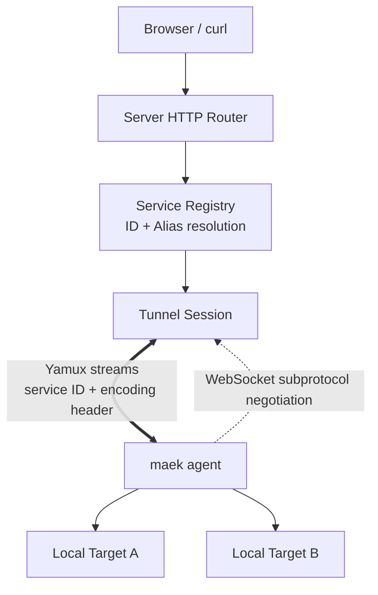

<div align="center">

# maek<span style="color:#1d9bf0">.</span>

**Instant tunnels to your localhost. Zero DNS, zero accounts, pure simplicity.**

*The self-hosted, single-binary ngrok alternative with automated link previews and Twitter-style dashboard.*

<br/>

[](https://go.dev/)
[](LICENSE)
[](https://hub.docker.com/)
[](#zero-config-routing-no-wildcard-dns)
[](#architecture)

<br/>

</div>

```bash
# 1. On your VPS
maek server -p 8080

# 2. On your local machine
curl -fsSL http://<VPS-IP>:8080/_maek/install.sh | sh
maek agent -s ws://<VPS-IP>:8080 -t http://localhost:3000
```

---

## Why maek?

Run one tiny binary on a VPS and expose multiple private services without accounts, wildcard DNS, or third-party tunnel infrastructure.

| Feature | `maek` | `ngrok` (Free) | Cloudflare Tunnel | `frp` |
| :--- | :---: | :---: | :---: | :---: |
| **Account / Sign-up** | None | Required | Required | None |
| **Custom Domain / Wildcard DNS** | Not needed | Random subdomains | Domain required | Wildcard DNS required |
| **Tunnel Limits & Pricing** | Unlimited | 1 tunnel / rate limits | Free | Self-hosted |
| **Private / Airgap Network** | Fully self-contained | Cloud only | Cloud only | Manual binary copy |
| **Web Catalog Dashboard** | Yes | Web dashboard | Cloud console | Basic admin UI |
| **Auto Metadata Scraping** | Title, icon, description | None | None | None |
| **WebSocket & Vite HMR** | Yamux multiplexing | Yes | Yes | Yes |

---

## Key Features

### Single-IP, Zero-DNS Multi-Tenant Routing

* **3-Way Routing Engine**: session cookies for browsers, direct alias URLs (`/_maek/:alias`), and `X-Maek-Service` headers for APIs.
* **Aliases are intentionally non-unique**: the oldest active service owning an alias receives alias-based traffic; when it disconnects the next-oldest active service takes over.
* **IDs are unique while active** and are safe to use for deterministic routing.
* **Smart Messenger Previews** and an injected floating widget remain available for proxied HTML services.

### Versioned Wire Protocol

Agent and server negotiate a `maek.vN` WebSocket subprotocol before any maek data is exchanged. Wire-protocol versions are independent from binary release versions.

Protocol v1 includes:

* HELLO/WELCOME capability negotiation.
* Negotiated stream content encoding (`identity`, `gzip`).
* A binary stream header carrying protocol version, stream kind, encoding, and service ID.
* Multiple services registered over one Agent ↔ Server session.
* Yamux multiplexing after protocol negotiation.

### Concurrency-safe Service Lifecycle

Service IDs are reserved before registration commits. Registry cleanup is generation-scoped, so a stale connection cannot delete a newer service that later reused the same ID.

---

## Architecture



Connection setup:

```text
WebSocket upgrade (maek.vN)
  -> HELLO / WELCOME
  -> REGISTER [service...]
  -> REGISTERED [assigned ID...]
  -> START
  -> Yamux data plane
```

---

## Quick Start

### 1. Start Server

```bash
./maek server -p 8080
```

Or via Docker:

```bash
docker run -d --name maek -p 8080:8080 --restart always ghcr.io/gosuda/maek:latest
```

### 2. Install Agent

**macOS / Linux**:

```bash
curl -fsSL http://<VPS-IP>:8080/_maek/install.sh | sh
```

**Windows (PowerShell)**:

```powershell
irm http://<VPS-IP>:8080/_maek/install.ps1 | iex
```

### 3. Connect a Local Service

```bash
# Zero-config (alias/metadata auto-detected from target)
maek agent -s ws://<VPS-IP>:8080 -t http://localhost:3000

# Custom alias and preferred ID
maek agent -s ws://<VPS-IP>:8080 -a dev-app -i my-app -t http://localhost:3000
```

### 4. Access & Share

* **Web Catalog**: `http://<VPS-IP>:8080/`
* **Alias URL**: `http://<VPS-IP>:8080/_maek/dev-app`
* **ID routing**:

```bash
curl -H "X-Maek-Service: my-app" http://<VPS-IP>:8080/api/health
```

---

## CLI Reference

### `maek server`

```text
Usage: maek server [flags]

Flags:
  -addr, -p string   Address or port to listen on (default ":8080")
```

### `maek agent`

```text
Usage: maek agent [flags]

Flags:
  -server, -s string   Central maek server URL
  -alias, -a string    Service alias (optional, auto-detected from target)
  -id, -i string       Preferred custom service ID (optional, max 32 chars)
  -desc, -d string     Short description (optional, auto-detected)
  -thumb string        Thumbnail URL or image avatar (optional, auto-detected)
  -target, -t string   Local target HTTP URL (default "http://localhost:3000")
```

The Go Agent API supports multiple `ServiceConfig` entries in one connection even though the CLI currently configures one service per invocation.

---

## Endpoints Reference

| Endpoint | Method | Description |
| :--- | :---: | :--- |
| `/` | `GET` | Catalog Web UI or proxy to selected service |
| `/_maek` | `GET` | Clears active routing cookie and returns to catalog |
| `/_maek/<alias\|id>` | `GET` | Direct service route; duplicate aliases resolve oldest-active-first |
| `/_maek/ws` | `GET` | Version-negotiated Agent WebSocket endpoint |
| `/_maek/api/services` | `GET` | Active service metadata including `id` and `alias` |
| `/_maek/thumb` | `GET` | Thumbnail endpoint |
| `/_maek/install.sh` | `GET` | macOS / Linux installer |
| `/_maek/install.ps1`| `GET` | Windows installer |
| `/_maek/download` | `GET` | Binary download endpoint |
| `/_maek/version` | `GET` | Server binary version information |

---

## Development

```bash
make test   # go test -race -v -count=1 ./...
make build
```

---

## License

Distributed under the MIT License. See [LICENSE](LICENSE) for more information.
